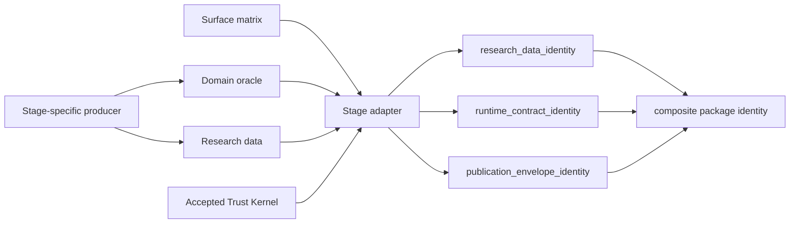

# Research Package Trust Kernel 执行方案

日期：2026-08-17

状态：

- 仅方案设计；
- 尚未派发正式 workflow task；
- 尚未抽取代码、修改 Stage 4 package、清理目录或传输归档。

## 1. 目标

本任务把 SKHYNIX Stage 4 在 QA Round 3-6 中逐轮补齐的通用信任逻辑，
沉淀为一次性、版本化、可被后续 research stage 复用的工程基础设施。

交付目标有六项：

1. 建立 `Research Package Trust Kernel` 共享模块。
2. 将 package identity 拆成三个相互独立、可组合的身份层。
3. 用已验收 Stage 4 package 证明抽取前后 admission parity。
4. 把 surface matrix、七条 exit criteria 和 hostile preflight 固化进
   `.workflow`。
5. 删除 `local_live_analysis/` 下七个已经确认的 Stage 4 空残留目录。
6. 把 1.5GB Stage 4 正式包原样归档到 amdserver 的 durable archive
   root。

完成后的默认规则是：

```text
通用 package trust 由 accepted kernel version 负责。

每个新 research stage 只负责：
1. pin accepted kernel；
2. 填完整 surface matrix；
3. 实现并验证自己的 domain oracle / adapter；
4. 证明自己的 outputs 与 surface matrix 一致。
```

这不会取消 stage-specific QA。它只把下面这些与研究对象无关的信任问题
从每个 stage 的 QA 中移出：

- exact evidence object；
- exact key/type/value universe；
- canonical serialization；
- exact `lstat` tree closure；
- layered inventory identity；
- atomic publication；
- verify-only zero-write；
- fail-closed admission。

## 2. 已验收基线

本任务必须把以下 Stage 4 QA Round 6 结果作为 immutable parity anchor。

正式 package：

```text
local_live_analysis/
skhynix_trigger_aligned_episode_research_v1_stage04_jul30_episode_v3/
```

接受身份：

| Identity | Accepted value |
| --- | --- |
| files / artifacts / bytes | `107 / 106 / 1,561,307,420` |
| legacy core | `78be6559c7ac5aaec4d5411b042f7ddcce522473f60f987237bcaa9d2dd5e157` |
| legacy full inventory | `669fb7d12f25cfa7828aec0fb1546398b1def754952de2290cd19784a477a433` |
| frozen contract | `b80b9bae2d6cf18cb6e7be4f133467138527fec20eef7054ab38b7f8c70cefde` |
| manifest raw bytes | `2c802336c1446eaf50eaf5ef546b115046abe3a1b69fdd1fcaea31d22a8e64a6` |

Durable research-data identity：

| Metric | Accepted value |
| --- | --- |
| research files | `99` |
| research bytes | `1,560,514,934` |
| canonical inventory SHA256 | `bb5aed2099b1a97da5b476d4b09dfe4a7bac06f0bf331f8ca864a88daf5c9232` |
| durable inventory file SHA256 | `07521dbc2c8bfe5f41a3ab14ac5493591dad878d52053b2d74aad251b9f022df` |

QA Round 6：

| Evidence | Accepted value |
| --- | --- |
| QA status | `已通过` |
| P0/P1/P2/P3 | `0/0/0/0` |
| aggregate negative calls | `98/98` fail closed |
| direct tree calls | `36/36` fail closed |
| production package tree attacks | `12/12` fail closed |
| current related tests | `396 passed` |
| archived Stage 4 focused tests | `97 passed` |
| QA report SHA256 | `0b85ae527f7e91f40f3e4401969596ff6462964a7e05cb8d0de73e763ad3e592` |

本任务不能重新解释、覆盖或替换这些 accepted identities。新分层身份是
附加的 trust representation，不是对 legacy Stage 4 验收结果的改写。

## 3. 非目标和硬边界

本任务是纯工程任务，不做任何新的研究判断。

禁止：

- 修改 99 个 accepted research CSV/GZ；
- 重算或改变任何 Episode row；
- 改变 Candidate、Confirmed、Family A、Family B 定义；
- 改变 feature、path、outcome、censor 或 detector semantics；
- 重建 1.5GB Stage 4 package；
- 读取 Aug03/Aug04 future event rows；
- 读取 Aug07 event rows；
- 运行 case retrieval、model、score 或 transfer research；
- 运行 actionability、own-order、fill、PnL 或 live execution；
- 把 SKHYNIX symbol、字段、计数、segment ID 或绝对路径写进通用 kernel；
- 原地修改 accepted Stage 4 package；
- 删除任何非空目录；
- 在 remote archive 通过前删除本机正式包。

允许：

- 只读扫描 accepted Stage 4 package；
- 只读运行一次完整 Stage 4 admission；
- 构建秒级 synthetic fixtures；
- 新增共享 kernel、Stage 4 compatibility adapter、测试和 workflow 模板；
- 创建 package 外部的 layered trust envelope；
- 将正式包 byte-exact 复制到 amdserver；
- 删除七个 exact-name、真实目录、内容为空的残留目录。

## 4. 总体架构

### 4.1 Trust boundary 分层



责任边界：

| Component | Owns | Must not own |
| --- | --- | --- |
| producer | 研究数据生成 | 通用 package trust 规则 |
| domain oracle | source semantics 重建 | filesystem/publication policy |
| stage adapter | surface matrix 到 kernel contract 的映射 | 自创 kernel 规则 |
| trust kernel | evidence、tree、identity、publication、admission | SKHYNIX 或策略语义 |
| workflow | 派发与 QA 的结构化 gate | 研究结论 |

### 4.2 不能错误地“一次 QA 后永远信任”

Kernel QA 通过后，后续 stage 可以不再重复攻击 kernel 内部，但仍必须检查：

1. pin 的 kernel version、source-tree SHA 和 acceptance receipt 都 exact；
2. stage adapter 实际调用了被 pin 的 kernel；
3. surface matrix 完整覆盖当前 stage 的全部 load-bearing outputs；
4. domain oracle 对当前 stage 的字段、时间和 source truth 是正确的；
5. adapter 没有在 kernel 前后缩小、伪造或绕过 evidence；
6. package 的实际层级身份与 manifest 声明一致。

Kernel 只摊薄通用信任成本，不替代研究语义 QA。

## 5. Deliverable A：Research Package Trust Kernel

### 5.1 建议代码布局

第一版使用当前 repository 最稳定的 Python import 边界：

```text
examples/hyperliquid/research_package_trust/
    __init__.py
    errors.py
    canonical.py
    evidence.py
    tree.py
    identity.py
    publication.py
    admission.py
    contracts.py

examples/hyperliquid/research_package_trust_cli.py
examples/hyperliquid/research_package_trust_stage4_adapter.py

examples/hyperliquid/test_research_package_trust_evidence.py
examples/hyperliquid/test_research_package_trust_tree.py
examples/hyperliquid/test_research_package_trust_identity.py
examples/hyperliquid/test_research_package_trust_publication.py
examples/hyperliquid/test_research_package_trust_stage4_parity.py
```

选择这一位置的原因：

- 当前 Stage 1-4 research tooling 已集中在 `examples/hyperliquid/`；
- 不需要新增 packaging/install 步骤；
- existing scripts 可以稳定 import sibling package；
- 模块本身通过 purity contract 禁止依赖任何 SKHYNIX/cross-exchange
  producer。

未来如需跨 `examples/` 目录复用，可以在 kernel v2 中迁入正式 Python
package；不能在 v1 实现中同时扩大 packaging 范围。

### 5.2 Kernel public API

Kernel v1 至少提供以下稳定 API：

```text
scan_exact_tree(root, tree_contract)
build_inventory(root, surface_contract)
validate_exact_object(observed, exact_contract)
validate_surface_matrix(matrix)
compute_research_data_identity(...)
compute_runtime_contract_identity(...)
compute_publication_envelope_identity(...)
compute_composite_package_identity(...)
admit_package(package_root, contract, semantic_evidence)
publish_atomically(staging_root, final_root, publication_contract)
```

Public return values 必须是 dataclass 或 canonical JSON-compatible object。
失败必须抛出统一：

```text
TrustKernelError(code, location, detail)
```

测试和下游 QA 应优先断言稳定 error code，不依赖易变的完整英文错误文本。

### 5.3 Purity contract

Kernel source 必须满足：

- 不 import `cross_exchange_trigger_aligned_episodes`；
- 不 import任何 SKHYNIX-specific module；
- 不包含 `SKHYNIX`、`SKHX`、`Jul30`、Family A/B 字段或 accepted counts；
- 不包含 absolute package/input root；
- 不读取 network、environment secrets、clock 或当前日期；
- admission API 只读；
- publication API 只能写调用方明确传入的 staging/final roots；
- canonicalization、hash 和排序规则完全由显式 contract 决定；
- 相同 bytes/contract 在 macOS 与 Linux 产生相同 identity；
- `bool` 不得通过 canonical integer validation；
- unknown key、unknown entry type 和 unknown contract version 全部
  fail closed。

### 5.4 从现有 Stage 4 抽取的通用逻辑

应抽取：

- canonical JSON bytes/hash；
- exact typed object validation；
- exact key-universe validation；
- canonical SHA256 validation；
- exact binding derivation；
- `lstat` entry classification；
- exact root/descendant tree scan；
- regular-file inventory；
- artifact file/directory closure；
- layered identity calculation；
- staging fsync；
- atomic directory publication；
- verify-only zero-write support；
- canonical admission result。

不得抽取到 kernel：

- `_candidate_iter()`；
- `_feature_rows()`；
- `_outcome_row()`；
- `_verify_source_semantics()` 的 SKHYNIX projection implementation；
- detector burst、Candidate/Confirmed、interval censoring 规则；
- 12 个 projection 的名称、字段和 accepted counts；
- Stage 1/2/3 absolute dependency roots；
- Stage 4 report 文本。

这些内容保留在 immutable legacy implementation 或 Stage 4 adapter。

### 5.5 Kernel version 和 acceptance pin

Kernel 第一版建议命名：

```text
research_package_trust_kernel_v1
```

验收后生成：

```text
baselines/research_package_trust_kernel/v1/
    kernel_acceptance.json
    api_contract.json
    negative_matrix.json
    fixture_inventory.json
```

每个 future stage 必须 pin：

```text
kernel_name
kernel_version
kernel_source_tree_sha256
kernel_api_contract_sha256
kernel_negative_matrix_sha256
kernel_qa_report_sha256
kernel_acceptance_task_id
```

Version string 相同但任何 source byte 改变，都视为非法 drift。

任何 kernel 修改必须：

1. 使用新 version；
2. 新建正式 workflow task；
3. 重跑完整 kernel negative matrix；
4. 重新独立 QA；
5. 发布新的 acceptance receipt。

## 6. Deliverable B：三层 Package Identity

### 6.1 Identity 1：`research_data_identity`

它只描述研究数据本身。

Canonical inventory row：

```json
{
  "path": "relative/path.csv.gz",
  "bytes": 123,
  "sha256": "lowercase-64-hex"
}
```

计算规则：

- relative path 必须 canonical；
- path、bytes 和 SHA 全部进入 identity；
- absolute root、mtime、ctime 和 host 不进入 identity；
- symlink 或 special entry 在计算前 fail closed；
- 一个文件必须且只能属于一个 research-data surface；
- unknown、unassigned 或 duplicate assignment 全部 fail closed。

`surface_id`、schema 和 file-to-surface assignment 属于
`runtime_contract_identity`。这样 research-data identity 只回答“哪些
research bytes 被冻结”，不会因为解释合同改变而错误变化。

对 legacy Stage 4 compatibility adapter：

- research-data file set 必须 exact 等于 durable inventory 的 99 个文件；
- bytes 和 raw SHA 必须逐文件 exact；
- 新 identity 的 canonicalization 应复用 durable inventory 口径；
- 目标值必须等于：
  `bb5aed2099b1a97da5b476d4b09dfe4a7bac06f0bf331f8ca864a88daf5c9232`。

### 6.2 Identity 2：`runtime_contract_identity`

它描述“如何解释和验证 research data”。

必须绑定：

- accepted kernel pin；
- stage adapter source SHA；
- domain oracle source SHA；
- surface matrix SHA；
- 每个 research file 的 exact surface assignment；
- schema/field contracts；
- exact evidence contract；
- dependency identities；
- input-binding contract；
- calculation/contract versions；
- packaged runtime tests 的 exact source SHA；
- hard-boundary declaration。

它不重新哈希 1.56GB research data，只绑定
`research_data_identity` 的 expected relation。

### 6.3 Identity 3：`publication_envelope_identity`

它描述 package 如何被发布、定位和承认。

必须绑定：

- `research_data_identity`；
- `runtime_contract_identity`；
- exact envelope file/directory universe；
- tree-entry type contract；
- canonical manifest bytes；
- atomic publication contract；
- verify-only zero-write contract；
- archive/reference metadata schema；
- composite package identity rule。

为了避免 manifest 自引用：

- envelope inventory 不包含最终 `package_seal.json` 自身；
- `package_seal.json` 保存 R/C/E 三个 identity 和 composite identity；
- admission 对 seal 使用 exact canonical bytes；
- exact tree contract 明确 seal 是唯一允许但不参与自身摘要的文件。

### 6.4 Composite identity

统一消费入口使用：

```text
package_identity = SHA256(
  canonical_json({
    "research_data_identity": R,
    "runtime_contract_identity": C,
    "publication_envelope_identity": E
  })
)
```

### 6.5 Identity 隔离验收

必须用 metamorphic tests 证明：

| Mutation | R | C | E | Composite |
| --- | --- | --- | --- | --- |
| research data byte/path | change | unchanged or rejected | change | change |
| schema/surface assignment | unchanged | change | change | change |
| kernel/adapter/contract/test | unchanged | change | change | change |
| envelope/report/publication policy | unchanged | unchanged | change | change |
| absolute package relocation | unchanged | unchanged | unchanged | unchanged |
| mtime/ctime only | unchanged | unchanged | unchanged | unchanged |
| symlink/special entry | reject | reject | reject | reject |
| unknown file or directory | reject | reject | reject | reject |

这张 mutation matrix 是 identity layering 的硬验收，不是说明性示例。

### 6.6 Legacy Stage 4 迁移方式

禁止原地迁移 accepted Stage 4 package。

本任务在 package 外创建小型 compatibility envelope，例如：

```text
local_live_analysis/
skhynix_stage04_episode_v3_trust_envelope_v1/
    surface_matrix.json
    research_data_inventory.json
    runtime_contract_inventory.json
    publication_envelope_manifest.json
    package_seal.json
    stage4_legacy_identity_bridge.json
```

Bridge 必须记录：

- legacy core/full/contract/manifest identities；
- 99-file durable research identity；
- accepted QA Round 6 report identity；
- legacy package locator 只作为运行参数，不进入三层 identity；
- accepted package root relocation 不改变 identity；
- legacy package 本身没有被修改。

Future native package 可以使用 content-addressed research-data object 和
small versioned envelope；legacy Stage 4 只通过 bridge 进入新体系。

## 7. Deliverable C：Stage 4 Admission Parity

### 7.1 Parity 原则

复用 Stage 3 detector extraction 的纪律：

```text
抽取不是“看起来等价”。

抽取后的 kernel + Stage 4 adapter 必须在机器上复现
已验收实现的同一判定、同一 identity 和同一 fail-closed boundary。
```

### 7.2 Legacy implementation 保持冻结

accepted package 内的：

- archived builder；
- archived admission；
- archived focused tests；
- frozen contract；
- manifest；

保持 byte-exact，不原地改造。

新 kernel 通过 compatibility adapter 读取 legacy package。这样能够：

- 保留 Round 6 accepted evidence；
- 避免 current source 改动导致 archived-source binding drift；
- 不要求重新构建 1.5GB package；
- 让 legacy verifier 成为 parity oracle，而不是被抽取过程覆盖。

### 7.3 Full admission parity

业务线程和独立 QA 各运行一次完整、只读 admission：

```text
accepted legacy verifier -> accepted Stage 4 package
new kernel + Stage 4 adapter -> same accepted Stage 4 package
```

两侧必须逐项一致：

- pass/fail；
- files/artifacts/bytes；
- legacy core/full/contract/manifest；
- 99-file durable inventory；
- 12 projection names；
- 12 projection fields；
- expected/observed row counts；
- expected/observed digest；
- mismatch rows；
- 28 aggregate-output counts；
- exact path/directory universe；
- boundary declarations；
- dependency/input identities；
- zero-write result。

新 kernel 额外发布 R/C/E/composite identities，但不能改变 legacy result。

### 7.4 不做 full rebuild

本任务不运行：

```text
cross_exchange_trigger_aligned_episodes.py --output-dir <new 1.5GB package>
```

原因：

- 研究数据生成器没有改变；
- parity 目标是 admission extraction；
- durable inventory 已证明 99 个 research files 不变；
- full rebuild 会重新引入本任务要消灭的成本结构。

如果 parity 只有重新 build 才能成立，应直接判定抽取设计失败，不允许
用重建掩盖 compatibility 问题。

## 8. Deliverable D：永久 Negative Test Matrix

### 8.1 秒级 fixture

创建一个小型 package fixture：

- 2-4 个 research data files；
- 2 个 runtime/contract files；
- 1 个 canonical manifest；
- 1 个 surface matrix；
- 1 个 package seal；
- 小于 `1MB`；
- 完整测试目标应在普通开发机秒级完成。

Fixture 只缩小数据体积，不能缩小 contract shape 和 attack classes。

### 8.2 Aggregate matrix

保留 QA Round 6 的完整逻辑：

- `49` 个 unique mutation cases；
- current kernel 与 frozen packaged kernel snapshot 各执行一次；
- 总计 `98/98` negative calls。

必须覆盖：

- semantic evidence missing/not-dict/false/extra；
- scope missing/extra/type/value；
- projection missing/extra/non-dict；
- entry missing/extra/non-dict；
- fields type/value/order；
- count value/bool/string；
- digest mismatch/malformed/uppercase/non-string；
- mismatch nonzero/bool/string；
- exact counts missing/extra/value/type；
- aggregate counts missing/extra/value/type；
- binding duplicate/empty/missing/extra/bool/string。

### 8.3 Direct tree matrix

保留同一调用口径：

- 6 类 entry/root attack；
- 3 个 load-bearing kernel boundary；
- current/frozen 两套 kernel；
- 总计 `36/36` calls。

Attack：

- dangling symlink；
- symlink -> regular file；
- symlink -> directory；
- FIFO；
- Unix socket；
- root symlink。

Boundaries：

- exact tree inventory；
- artifact record construction；
- artifact/tree closure。

### 8.4 Production-shape admission matrix

使用完整 CLI/admission path，但仍使用小 fixture：

- 6 类 tree attack；
- current/frozen 两套 kernel；
- 总计 `12/12` calls。

必须证明：

- `rc != 0`；
- `verified=false`；
- 不输出可信 R/C/E/composite identity；
- 在 domain semantic replay 前快速拒绝；
- 不产生 package 内写入。

### 8.5 额外永久测试

新增：

- identity layer isolation matrix；
- canonical relocation；
- seal self-reference exclusion；
- surface assignment missing/duplicate；
- unknown kernel version；
- kernel source pin drift；
- adapter bypass；
- zero-write under default Python；
- partial publication；
- existing final output preservation；
- staging cleanup；
- source and frozen-kernel result parity。

## 9. Deliverable E：Workflow 模板固化

### 9.1 适用范围

不是所有普通代码任务都需要 surface matrix。

以下任务必须使用新模板：

```text
produces_research_package = true
```

包括：

- 新研究数据集；
- 新 label/feature/outcome package；
- 新 model-evaluation package；
- 会被后续 stage 当作 accepted dependency 的 research artifact bundle。

普通 bugfix、docs-only 和不产生 research package 的任务可以声明：

```text
produces_research_package = false
```

### 9.2 Workflow 文件改动

正式实现应修改或新增：

```text
.workflow/workflow-kit/workflow-manual.md
.workflow/workflow-kit/task-dispatch-template.md
.workflow/workflow-kit/thread-report-template.md
.workflow/workflow-kit/qa-acceptance-template.md
.workflow/workflow-kit/research-package-task-template.md
.workflow/workflow-kit/research-package-surface-matrix.schema.json
.workflow/workflow-kit/validate_research_package_task.py
AGENTS.md
```

### 9.3 派发文档强制字段

每个 research-package task 必须内嵌填好的表：

| Surface | Authoritative source | Decision/as-of time | Exact fields/keys | Rebuild oracle | Negative mutation | Durable evidence | Identity layer |
| --- | --- | --- | --- | --- | --- | --- | --- |
| `<filled>` | `<filled>` | `<filled>` | `<filled>` | `<filled>` | `<filled>` | `<filled>` | `R/C/E` |

规则：

- 不允许空单元格；
- 不允许 `TBD`；
- 不允许只写 `same as source`；
- `unavailable` 必须说明原因和 fail-closed behavior；
- 每个 output family 至少一行；
- 每个 artifact 必须属于一个 surface；
- 每个 surface 必须绑定一个 identity layer；
- 每个 surface 必须有至少一个 negative mutation。

任务文件同时引用一份 canonical JSON：

```text
.workflow/contracts/<TASK_ID>-surface-matrix.json
```

JSON 是机器事实源；Markdown 表是派发时的人类审阅面。业务回报必须记录
最终 JSON SHA。

### 9.4 七条 Stage exit criteria

模板中固定加入：

1. 每个 load-bearing field 都有 authoritative source。
2. 每个 field 要么 exact source-derived，要么显式 unavailable。
3. 每个 evidence/manifest section 有 exact key/type/value universe。
4. 每个 filesystem entry 都进入 exact identity universe。
5. 每个 cross-repair unchanged claim 都有 durable prior evidence。
6. 每个 artifact family 至少有一个 coherent-rehash negative test。
7. fast hostile preflight 通过后，才允许 full deterministic build。

业务线程进入 `待验收` 前必须逐项写出：

```text
pass / fail / not-applicable-with-reason
```

### 9.5 Hostile preflight

research-package task 默认顺序：

```text
surface matrix validation
-> seconds-level hostile fixture
-> identity metamorphic tests
-> stage-specific small fixture
-> full build or full admission
-> business handoff
```

如果前三步任一步失败：

- 不允许运行 full build；
- 不允许发布 provisional package；
- 任务保持 `执行中` 或报告 `阻塞`。

### 9.6 QA Gate 0

QA 模板的第一项固定为：

```text
Gate 0: Surface Matrix Completeness
```

QA 必须在执行大型测试前检查：

- task 声明是否产生 research package；
- matrix 是否存在；
- machine schema 是否通过；
- Markdown 与 JSON 的 surface IDs 是否一致；
- 是否覆盖所有 artifact/output families；
- 七条 exit criteria 是否全部有证据；
- kernel pin 是否指向 accepted version。

任何一项未定义：

```text
直接未通过。

正向测试全部通过也不能覆盖 Gate 0 失败。
```

### 9.7 历史任务兼容

新规则只强制作用于生效日期之后新派发的 research-package task。

已有历史 task：

- 不批量改写；
- 不因缺少新字段而 retroactively 变成未通过；
- 如被重新打开或形成新 package version，则必须使用新模板。

## 10. Deliverable F：Stage 4 Hygiene 和 Durable Archive

### 10.1 七个空目录

只允许删除以下 exact paths：

```text
local_live_analysis/skhynix_trigger_aligned_episode_research_v1_stage04_jul30_episode_v3 2
local_live_analysis/skhynix_trigger_aligned_episode_research_v1_stage04_jul30_episode_v3 3
local_live_analysis/skhynix_trigger_aligned_episode_research_v1_stage04_jul30_episode_v3 4
local_live_analysis/skhynix_trigger_aligned_episode_research_v1_stage04_jul30_episode_v3 5
local_live_analysis/skhynix_trigger_aligned_episode_research_v1_stage04_jul30_episode_v3 6
local_live_analysis/skhynix_trigger_aligned_episode_research_v1_stage04_jul30_episode_v3 7
local_live_analysis/skhynix_trigger_aligned_episode_research_v1_stage04_jul30_episode_v3 8
```

删除前每个 path 必须：

- `lstat` 为真实 directory；
- 不是 symlink；
- exact entry count 为 `0`；
- path 等于 frozen allowlist；
- 不与正式 package path 相同。

任意一个 path 不满足：

- 七个目录全部不删除；
- 记录 fail-closed cleanup result；
- 不允许模糊匹配或扩大到其他 `stage04*` 路径。

删除后发布：

```text
.workflow/reports/<TASK_ID>-stage4-empty-dir-cleanup.json
```

内容包括 allowlist、pre-lstat、empty proof、post-absence 和执行时间。

### 10.2 amdserver durable root

建议 canonical archive root：

```text
/home/molly/research_archive/hftbacktest/skhynix/
jul30_episode_v3/0815T003/
669fb7d12f25cfa7828aec0fb1546398b1def754952de2290cd19784a477a433/
```

布局：

```text
<archive-root>/
    package/
    trust_envelope/
    evidence/
        0815T003-qa-round6.md
        durable_research_inventory.csv
        archive_receipt.json
        source_inventory.json
        destination_inventory.json
```

`archive_receipt.json` 和其他 archive evidence 位于 package 外，不能改变
accepted package identity。

### 10.3 Transfer protocol

1. 本机用 new kernel exact `lstat` scanner 扫描正式 package。
2. 确认 source identities 等于 QA Round 6 anchors。
3. amdserver preflight：
   - canonical parent 是真实 directory；
   - final 和 temp 不存在；
   - 可用空间至少为 package bytes 的三倍；
   - 没有 symlink/special parent component；
   - Python runtime 可运行 kernel inventory CLI。
4. 传输到同 filesystem 的 hidden temp root。
5. 在 amdserver 用 kernel 重算 exact tree、R/C/E 和 legacy identities。
6. source/destination 比较 exact relative path、entry type、mode、bytes、
   raw SHA。
7. fsync temp tree 和 parent。
8. atomic rename 为 final。
9. 在 final 上再运行一次 destination inventory。
10. 在 package 外原子写入 archive receipt。

禁止：

- 直接覆盖已有 final；
- 用 symlink 指向 worktree package；
- 只比较总 bytes；
- 使用 `is_file()/is_dir()` 形成 inventory；
- 未验证就删除 temp/source；
- 把 receipt 写进 accepted package。

### 10.4 Archive acceptance

Remote archive 必须满足：

- `107` regular files；
- `21` descendant directories；
- symlink/special `0`；
- bytes `1,561,307,420`；
- legacy core/full/contract/manifest exact；
- 99-file durable research inventory exact；
- R/C/E/composite exact；
- package tree 与本机 source 逐项 exact；
- remote archive path 不在任何 git worktree 内；
- transfer temp/residual partial path 为 `0`。

### 10.5 Replay portability 声明

当前 legacy Stage 4 verifier 还依赖 accepted Stage 1/2/3 和 Jul30 input
bindings。仅归档 1.5GB package 不等于归档全部 source-replay inputs。

Archive receipt 必须明确：

```text
byte_exact_package_archive = true
kernel_trust_admission_portable = true
full_source_semantic_replay_portable = true/false
external_dependency_bindings = [...]
```

如果 amdserver 没有全部 accepted dependencies/inputs：

- 可以接受 byte-exact durable archive；
- 不得宣称 remote self-contained full source-semantic replay；
- parity full admission 仍在现有 accepted local inputs 上完成。

本任务不静默扩大为“归档所有原始数据和所有前置 stage”。

### 10.6 本机 package 处置

本任务只把 amdserver 设为 canonical durable archive，不在同一任务中删除
本机正式 package。

原因：

- Stage 4 parity 需要该 package；
- 当前 accepted dependency paths 是本机 absolute roots；
- Stage 5 尚未决定在本机还是 amdserver 消费；
- 删除本机 package 会把纯 trust task 扩大成 dependency relocation。

任务通过后，本机目录降级为 cache。后续如需释放空间，必须另开一个明确
的 cache cleanup/relocation task。

## 11. 实施阶段

### Phase 0：冻结任务输入

交付：

- accepted baseline manifest；
- QA Round 6 identity anchors；
- accepted package pre-task exact inventory；
- 七个 empty-dir allowlist；
- proposed amdserver archive root；
- task surface matrix。

Gate：

- 任何 accepted identity 不匹配，任务立即阻塞；
- 不进入 kernel extraction。

### Phase 1：实现 kernel 和小 fixture

交付：

- versioned pure kernel；
- stable error codes；
- synthetic package fixture；
- current/frozen kernel snapshot；
- 98/36/12 negative matrix；
- zero-write 和 atomic publication tests。

Gate：

- 所有测试必须在秒级 fixture 上通过；
- 不读取正式 package。

### Phase 2：实现三层 identity

交付：

- R/C/E/composite contracts；
- identity manifests；
- mutation isolation matrix；
- Stage 4 layer assignment contract；
- legacy identity bridge。

Gate：

- 107 个 legacy files 必须全部且只属于一个 layer/surface；
- 99-file R identity 必须等于 durable accepted value。

### Phase 3：Stage 4 compatibility adapter 和 parity

交付：

- Stage 4 adapter；
- legacy/new verdict comparison；
- 一次 business full admission；
- no-write inventory comparison；
- parity report。

Gate：

- 任意 legacy field、count、digest、verdict 或 identity 不一致即失败；
- 不允许通过重建 package 修复。

### Phase 4：Workflow 固化

交付：

- manual/template/schema/validator 更新；
- valid/invalid task fixtures；
- Gate 0 测试；
- historical-task compatibility 测试。

Gate：

- 缺 matrix 的新 research-package task 必须被 validator/QA 模板拒绝；
- non-research task 不被误伤。

### Phase 5：Hygiene 和 remote archive

执行顺序：

1. archive preflight；
2. transfer temp；
3. remote exact verification；
4. atomic archive publish；
5. archive receipt；
6. 七个 empty dirs fail-closed cleanup。

Gate：

- archive 未完成时，不执行 cleanup；
- cleanup 不触碰正式 package；
- remote final 不允许部分成功。

### Phase 6：Business handoff

业务报告至少包含：

- commit；
- kernel pin；
- public API；
- negative matrix summary；
- identity isolation summary；
- Stage 4 parity result；
- pre/post accepted package inventory；
- workflow validator evidence；
- archive path/receipt/inventory；
- cleanup receipt；
- boundary scan；
- 是否进入 QA。

业务线程结束状态只能是：

```text
待验收
```

不能自行标记 kernel accepted。

## 12. Independent QA 方案

### Gate 0：Surface Matrix

第一项检查，失败直接 `未通过`：

- task matrix 完整；
- canonical JSON schema 通过；
- artifact/surface/layer assignment exact；
- 七条 exit criteria 有证据；
- 无 `TBD` 或未解释 unavailable。

### Gate 1：Kernel purity 和 version pin

检查：

- source 中无 SKHYNIX/domain constants；
- import boundary；
- deterministic canonicalization；
- stable error codes；
- source/frozen snapshot identity；
- accepted-version registry schema。

### Gate 2：Negative matrix

独立重跑：

- aggregate `98/98`；
- direct tree `36/36`；
- production-shape tree `12/12`；
- identity metamorphic matrix；
- zero-write；
- partial publication。

任意 fail-open 为 P1。

### Gate 3：Stage 4 parity

独立运行一次完整 admission：

- legacy archived verifier；
- new kernel + Stage 4 adapter；
- accepted formal package。

要求所有 legacy results exact，并验证：

- accepted package pre/post byte、type、mode、mtime/ctime 不变；
- 99-file durable inventory不变；
- package 内无 pycache/write；
- 不创建新 Stage 4 package。

### Gate 4：Workflow enforcement

独立构造：

- 完整合法 task；
- 缺 surface；
- 缺 authoritative source；
- 缺 negative mutation；
- 缺 identity layer；
- 含 `TBD`；
- non-research task。

预期：

- 前者通过；
- 五个不完整 research tasks fail closed；
- non-research task 正常通过。

### Gate 5：Remote archive

独立读取 amdserver：

- final path；
- source/destination inventory；
- exact identities；
- receipt canonical bytes；
- temp/residual paths；
- package 是否位于 git worktree 外；
- replay portability 声明是否诚实。

### Gate 6：Cleanup

确认：

- 七个 exact empty paths 不存在；
- 正式 package 存在且 identities 未变；
- 其他 `local_live_analysis` 路径未被删除；
- cleanup receipt exact。

### Gate 7：Hard boundary

确认：

- 99 个 research files unchanged；
- 未运行 full rebuild；
- 未改 research semantics；
- 未读取 later-session outcome；
- 未运行 model/actionability/order/live；
- 没有后台 transfer/test 进程残留。

QA 只有全部 Gate 通过，才能将 kernel version 标记为 accepted。

## 13. 验收标准

任务完成必须同时满足：

1. 通用 kernel 无 SKHYNIX specificity。
2. Kernel API 和 version pin 被 canonical contract 冻结。
3. 98/36/12 permanent negative matrix 在小 fixture 上通过。
4. R/C/E/composite identity 隔离测试通过。
5. Stage 4 legacy package 未修改、未重建。
6. 新 kernel 对 accepted Stage 4 package 的完整 admission 与 Round 6
   exact parity。
7. 99 research files exact，R identity 为 `bb5aed...9232`。
8. `.workflow` 对新 research-package task 强制 surface matrix、
   hostile preflight 和七条 exit criteria。
9. QA Gate 0 在 matrix 不完整时 fail closed。
10. 七个 exact empty dirs 被安全删除。
11. 正式包在 amdserver worktree 外形成 byte-exact durable archive。
12. archive receipt 不夸大 source-semantic replay portability。
13. 本机正式包保留为 cache，未在本任务中删除。
14. 独立 QA 为 `已通过`，且 P0-P3 全零。

## 14. 失败和回滚

### Kernel/Parity 失败

- legacy package 继续作为唯一 accepted dependency；
- 不发布 kernel acceptance receipt；
- future stage 不得 pin 未接受 kernel；
- 不修改 Stage 4 accepted status。

### Identity layering 失败

- 不允许只发布其中一两个 identity；
- R/C/E/composite 必须作为一个 versioned contract 同时进入 QA。

### Remote transfer 失败

- 保留本机正式 package；
- 删除或隔离 amdserver temp；
- 不创建 final；
- 不写 `passes=true` receipt。

### Cleanup precondition 失败

- 七个目录全部不删除；
- 记录失败 path 和 lstat/entry evidence；
- 不使用 `rm -rf stage04*` 一类宽匹配。

### Workflow validator 误伤历史任务

- 新规则只对新 task 或显式 reopened task 生效；
- 不批量修改历史任务；
- 不通过关闭 validator 来绕过问题。

## 15. 成本预算

目标预算：

| Work | Expected cost |
| --- | --- |
| kernel unit/negative tests | 秒级 |
| identity metamorphic tests | 秒级 |
| workflow validator tests | 秒级 |
| business full Stage 4 admission | 约 15-20 分钟 |
| QA full Stage 4 admission | 约 15-20 分钟 |
| full 1.5GB rebuild | `0` 次 |
| amdserver transfer | 约 1.5GB 单次传输 |

与 Stage 4 历史相比，本任务不允许出现：

```text
修改一个 trust assertion
-> Formal/Build A/Build B 全量重建
-> QA 再 full rebuild
```

未来 trust-only change 的目标成本是：

```text
小 fixture tests
-> 新 runtime/envelope identity
-> 一次 package admission
```

## 16. 建议正式任务边界

建议作为一个独立 formal task 派发，业务线程类型：

```text
业务线程-python/research-infra
```

建议标题：

```text
RESEARCH-PACKAGE-TRUST-KERNEL-LAYERED-IDENTITY-AND-STAGE4-PARITY
```

前置任务：

- `0815T003` 已通过；
- Stage 5 保持暂停；
- 本任务 QA 通过后，再决定 Stage 5 gap audit。

建议 files 范围：

```text
examples/hyperliquid/research_package_trust/**
examples/hyperliquid/research_package_trust_cli.py
examples/hyperliquid/research_package_trust_stage4_adapter.py
examples/hyperliquid/test_research_package_trust_*.py
baselines/research_package_trust_kernel/**
.workflow/workflow-kit/**
.workflow/contracts/<TASK_ID>-surface-matrix.json
.workflow/runners/<TASK_ID>_archive_stage4_to_amdserver.sh
.workflow/tasks/<TASK_ID>.md
.workflow/reports/<TASK_ID>-business.md
AGENTS.md
```

明确禁止修改：

```text
local_live_analysis/...stage04_jul30_episode_v3/**  # accepted formal package
99 accepted research files
Stage 1/2/3 accepted packages
Episode/detector/domain semantics
Stage 5 research outputs
```

例外 filesystem action：

- exact 删除七个 frozen empty paths；
- exact 创建 amdserver durable archive；
- package 外创建 local compatibility envelope。

## 17. 执行顺序结论

本任务可以作为 Stage 5 之前的当前唯一正式任务。

正确顺序是：

```text
冻结 Stage 4 anchors
-> kernel 小 fixture
-> 98/36/12 hostile matrix
-> identity layering
-> Stage 4 full admission parity
-> workflow template enforcement
-> amdserver durable archive
-> empty-dir cleanup
-> independent QA
-> controller 决定是否派发 Stage 5 gap audit
```

在独立 QA 接受 kernel 前：

- Stage 5 不派发；
- future stage 不得自称已 pin accepted kernel；
- accepted Stage 4 package 仍是唯一事实源。
